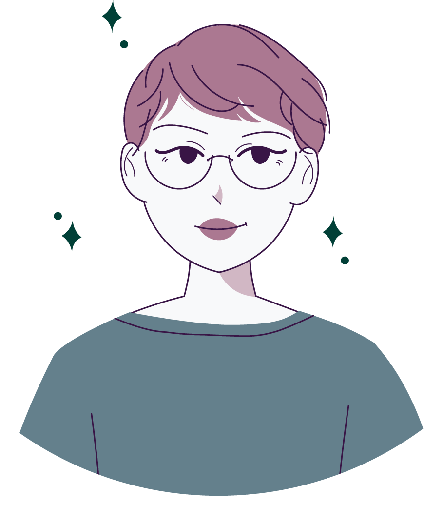

## Oii, eu sou Bianca Rodrigues 😊

 
 
    
 

- 🔭 Hoje eu sou Graduanda em Estatística pela Universidade Federal de Campina Grande 
- 🌱 Aprendendo sobre Ciência de dados com ênfase em aplicações em *Marketing* de relacionamento.
- 😄 Pronomes: ela/dela

#### 📌 Atualmente

- Estou trabalhando no meu TCC - Trabalho de Conclusão de Curso 🎓, cujo o tema é **"Isso é um adeus ou um até logo? Modelagem preditiva para
análise de evasão de clientes"**

#### 📫 Onde você pode me encontrar?

- [Instagram](https://www.instagram.com/crodriguesbianca/)  
- [Linkedinho](https://www.linkedin.com/in/bianca-rodrigues-1475aa201/)  
- [Blog no Medium](https://medium.com/@c.rodriguesbianca)  
- [Portfólio](https://rodriguesbianca.netlify.app/)

#### ❔ curiosidades: 
- Eu aaamo desenhar e bordar 💜 Você pode conhecer o meu atelier clicando [aqui](https://www.instagram.com/vezesdoisbordados/);
- Meu livro preferido é "Feliz ano velho" do Marcelo Rubens Paiva;
- Mantenho um diário sobre estudos e a vida, isso me ajuda a melhorar o meu *storytelling* :)

##

 
 
  
  
  
  
  
 

